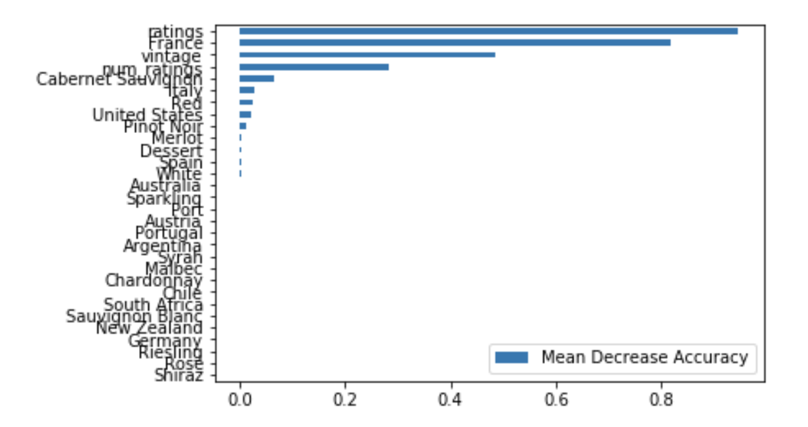
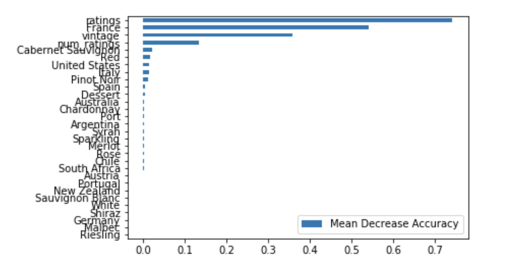

# Wine Predictions

## Introduction

In this project, I will predict the prices of the wines based on numerous factors, like vintage, country, ratings, type of grapes.

## Data Collection
I am using Selenium to scrape the data from Vivino.com, a popular wine review site, where there are over more than 100,000 wines. I used MongoDB as my database to store the data and convert it to DataFrame for analysis. I am focusing on a few popular countries that produce wines, with ratings above 3.5 stars and a price range of up to $250.

## Cleaning the data
After scraping the data, some prices are returning null since the price is not present on the site. I converted these null values to 0 and took out these rows so that my model will not take into account wines with $0 prices. 

## EDA

## Modeling

I looked into a few models to predict the wine prices.

### Linear Regression
The most basic model I go with since the result is continuous.

RMSE = 25.024

### Logistic Regression

I set a few thresholds for this model, setting a 0 if the price is below a certain threshold and 1 if the price is above a certain threshold

### Random Forest Regressor
Accuracy = 80.6%\
RMSE = 13.84

Feauture Importance

### Gradient Boosting

RMSE = 13.12

